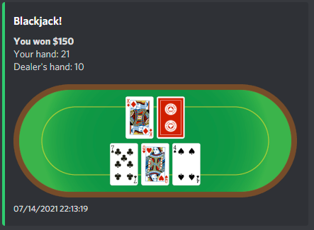
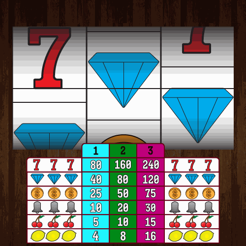

# Casino Bot

Casino bot is a gambling discord bot for your Discord server.

It is able to play blackjack, slots, flip a coin, and roll dice. It stores everyone's money on an SQLite3 database.

A Discord casino bot with support for multiple games and economy system.

It supports:
- Blackjack (reactions for hit/stand/double/split/surrender, insurance, split hands)
- High card (`highcard` / `war`)
- Slots (animated GIF reels + credit economy)
- Coin flip and dice roll
- Wallet commands (balance, leaderboard, periodic bonus)




## Architecture

- Discord bot entrypoint: `app/discord_bot/bot.py`
- Main entry: `main.py`
- SQLite economy layer: `app/discord_bot/modules/economy.py`

## Requirements

- Python 3.10+
- A Discord bot token

## Quick Start (Local)

1. Create and activate a virtual environment:

```bash
python -m venv venv
source venv/bin/activate  # On Windows: venv\Scripts\activate
```

2. Install dependencies:

```bash
pip install -r requirements.txt
```

3. Copy env template and edit values:

```bash
cp .env.example .env
```

4. Run the bot:

```bash
python main.py
```

## Environment Variables

Configured in `.env` (or process environment):

- `DISCORD_TOKEN`: Discord bot token (required).
- `DISCORD_OWNER_IDS`: Comma-separated Discord user IDs for owner-only commands.
- `DISCORD_PREFIX`: Prefix command trigger (default: `$`).
- `DISCORD_DEFAULT_BET`: Default money bet (default: `100`, allowed `1..1000000`).
- `DISCORD_BONUS_MULTIPLIER`: Bonus multiplier for `add` (default: `5`, allowed `1..1000`).
- `DISCORD_BONUS_COOLDOWN`: Bonus cooldown in hours (default: `12`, allowed `1..168`).
- `CASINO_DATA_DIR`: Base runtime data directory (default: `./data`).
- `CASINO_DATABASE_PATH` (optional): Override SQLite DB path.
- `CASINO_LOG_PATH` (optional): Override log file path.

See `.env.example` for current defaults.

## Discord Setup Notes

For prefix commands to work correctly, enable these in the Discord Developer Portal:

- Message Content Intent
- Server Members Intent

The bot requests standard intents for guilds, messages, message content, and members.

## Bot Commands

`$` is your `DISCORD_PREFIX`.

General:
- `$help [command]`
- `$add`
- `$money [@member]` (`$credits` alias)
- `$leaderboard` (`$top` alias)

Casino:
- `$blackjack [bet]` (`$bj` alias)
- `$highcard [bet]` (`$war` alias)
- `$flip <heads|tails> [bet]`
- `$roll <1-6> [bet]`
- `$slots [bet]` (credits, bet range 1-3)
- `$buyc <credits>` (`$buy`, `$b` aliases)
- `$sellc <credits>` (`$sell`, `$s` aliases)

Owner-only:
- `$set [balance|credits] [user_id] [amount]`
- `$kill`

## Web Demo

The demo frontend is served at `/` and `/demo` and talks to these API routes:

- `GET /api/demo/config`
- `POST /api/demo/command`
- `POST /api/demo/action`
- `POST /api/demo/reset`
- `GET /api/demo/assets/{asset_id}`

The demo runtime intentionally limits commands to:
- `help`, `money`, `blackjack`, `war`, `slots`

Rate limiting is enabled on demo API endpoints.

## Data, Logging, and Migrations

Runtime data defaults to `./data`:

- Database: `./data/economy.db`
- Logs: `./data/logs/casino-bot.log`

SQLite schema migrations are versioned and applied automatically on startup.

## Docker

Build:

```bash
docker build -t casino-bot .
```

Run (with persistent data mount):

```bash
docker run --rm -p 8000:8000 --env-file .env -v "$(pwd)/data:/app/data" casino-bot
```

Container defaults:
- Exposes port `8000`
- Runs as non-root user
- Healthcheck targets `GET /api/demo/config`
